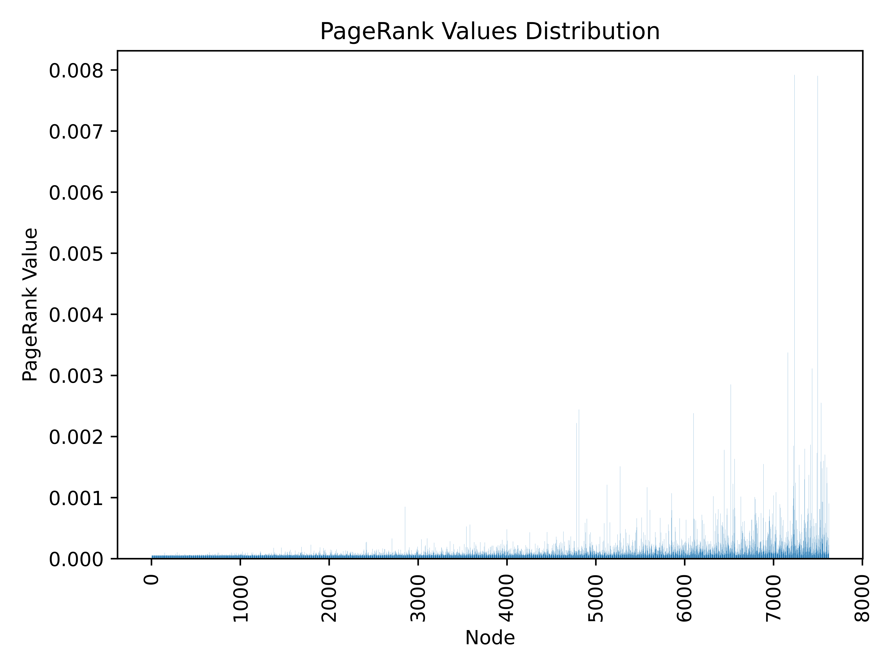
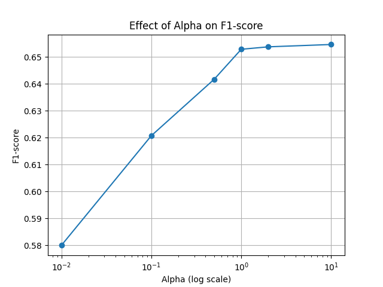
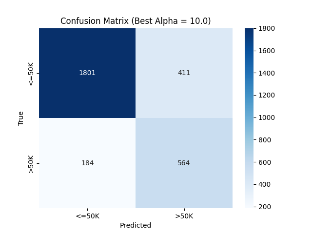

# 作业报告  

**学生姓名**:   
**学号**：  
**提交日期**：2025-10-31  

---

## 目录
1. [计算题](#计算题)
2. [PageRank 分析](#pagerank-分析)  
3. [朴素贝叶斯分类器分析](#朴素贝叶斯分类器分析)  

---

## 计算题
### 1-3

### 4

## PageRank 分析

### 任务说明
本次任务使用 `PageRank_Dataset.csv` 构建有向图，计算每个节点的 PageRank 值，并分析不同阻尼系数 α（β）对排名结果的影响。  

### 数据可视化
#### PageRank 值分布

#### 不同阻尼系数下前 10 个节点示例
| β | 排名 | 节点ID | PageRank 值 |
|---|---|---|---|
| 0.7 | 1 | 7237 | 0.00584 |
| 0.7 | 2 | 7339 | 0.00456 |
| 0.7 | 3 | 7498 | 0.00421 |
| 0.7 | 4 | 7162 | 0.00254 |
| 0.7 | 5 | 4811 | 0.00237 |
| 0.85 | 1 | 7237 | 0.00739 |
| 0.85 | 2 | 7498 | 0.00681 |
| 0.85 | 3 | 7339 | 0.00641 |
| 0.85 | 4 | 7162 | 0.00316 |
| 0.85 | 5 | 7224 | 0.00292 |
| 0.9 | 1 | 7237 | 0.00792 |
| 0.9 | 2 | 7498 | 0.00790 |
| 0.9 | 3 | 7339 | 0.00713 |
| 0.9 | 4 | 7162 | 0.00337 |
| 0.9 | 5 | 7224 | 0.00313 |

### 分析说明
- 节点 7237、7339、7498 等在不同 β 下均排名靠前，说明这些节点在网络中极具中心性。  
- 随着 β 增大（随机跳转减少），高 PageRank 节点的值略微增大，网络重要节点的影响力更明显。  
- 前 10 个节点在不同 β 下整体排名稳定，说明 PageRank 对网络结构的反映具有一定鲁棒性。  

---

## 朴素贝叶斯分类器分析

### 任务说明
使用 `Bayesian_Dataset_train.csv` 训练 CategoricalNB 模型预测收入是否大于 50K，并通过调节 α 超参数分析模型性能变化。  

### 数据可视化
#### 不同 α 下 F1-score 变化

#### 最优 α 的混淆矩阵

### 结果统计
| α | Precision | Recall | F1-score |
|---|---|---|---|
| 0.01 | 0.5318 | 0.6377 | 0.5799 |
| 0.10 | 0.5794 | 0.6684 | 0.6207 |
| 0.50 | 0.5846 | 0.7112 | 0.6417 |
| 1.00 | 0.5846 | 0.7393 | 0.6529 |
| 2.00 | 0.5811 | 0.7473 | 0.6538 |
| 10.0 | 0.5785 | 0.7540 | 0.6547 |

### 分析说明
- 最优 α 为 10.0，对应 F1-score 最高，为 0.6547。  
- 模型在预测收入 >50K 的类别表现稍差，可能因为样本不平衡。  
- 可以进一步改进模型，如增加特征、平衡类别或尝试其他分类器。  

### 结论
- PageRank 分析显示网络中节点重要性分布稳定，高中心性节点在不同 β 下排名靠前。  
- 朴素贝叶斯分类器在类别型特征上表现良好，调节 α 可以显著影响 F1-score。  
- 本次作业可视化结果和 CSV 文件均已保存，便于进一步分析和提交。  

---

## 附录
- 代码及数据文件请参考[GitHub 仓库](https://github.com/Faramita2/cs-math)或附件压缩包。  
- PageRank 结果：`results/pagerank/pagerank_results.csv`  
- Naive Bayes 预测结果：`results/bayesian/Bayesian_Dataset_test_with_predictions.csv`
---

